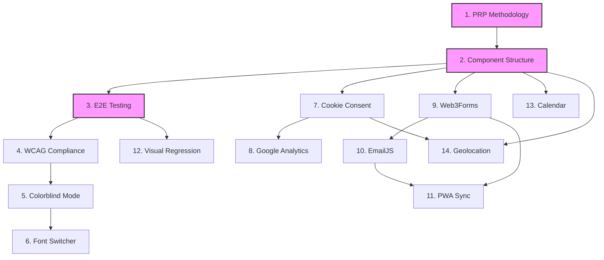

# PRP Implementation Status Dashboard

**Last Updated**: 2026-05-17 (Phase 0.5 / #48 Three.js Game shipped — PR #95 047)
**Previous Update**: 2026-05-14 (v0.4.x stabilization milestones)
**Total PRPs**: 16 (legacy) + 49 (SpecKit features — 000-brand-identity and 000-landing-page split out from 000-rls)
**Completed**: 15 legacy PRPs (v0.3.0) + 18 SpecKit features Shipped + 5 Mostly Shipped (019 GA moved Shipped → 23 total)
**In Progress (Partial)**: 19 features (most of payments tier, blog/sidebar polish, OAuth UX fixes)
**Not Started**: 4 features (013, 016, 028, 044)
**Backend Only**: 3 features (014, 040, 042)
**Current Phase**: v0.4.x stabilization — **E2E flake mitigation closed at round 10 on 2026-05-13** (concurrency mutex + WebKit scroll-event fix). See [STATUS.md](../../STATUS.md) for one-screen view.

> **Important note**: The 2026-04-25 audit was the first full sweep across all 47 features. Don't trust spec.md `**Status:**` fields anywhere — they were uniformly stale and have been refreshed in the Phase 4 spec-update batch. This 2026-05-14 refresh updates the dashboard header + hotspots table for the round-10 E2E closure and #31 GA4 closure; the per-feature audit data below remains the canonical detail.

---

## v0.4.x updates since 2026-04-25 audit

Six PRs landed 2026-05-12 to 2026-05-14 closing the round-10 E2E flake pattern and improving fork-onboarding:

- **#86** `fix(docker): pin pnpm version` — Dockerfile pulled `pnpm@latest` which broke 2026-05-12 when pnpm 11.1.1 shipped a stricter PNPM_HOME/PATH check. Pinned to `pnpm@10.16.1` matching `package.json` packageManager field.
- **#88** `docs(auth): #85 replace stale Supabase project ref with placeholder` — 32 stale `vswxgxbjodpgwfgsjrhq` refs across 5 docs files swept to `<YOUR-PROJECT-REF>` placeholders.
- **#89** `fix(ci): serialize E2E runs via repo-wide concurrency mutex` — **closes 9 rounds of "ongoing" E2E flake mitigation**. Root cause was two concurrent CI runs racing against the same Supabase project (each run's `cleanupOldMessages` `beforeAll` hooks wiped data the other run was polling for). Fix: `.github/workflows/e2e.yml` `concurrency` group `e2e-supabase-${{ github.repository }}` with `cancel-in-progress: false`. Bundled WebKit scroll-event fix (4 `el.scrollTop = N` sites in `tests/e2e/messaging/` now also dispatch `Event('scroll', {bubbles:true})` since WebKit doesn't auto-fire it for programmatic scrollTop assignments).
- **#90** `docs(status): #31 close + round 10 E2E flake mitigation resolution` — STATUS.md refreshed with the round-10 closure framing.
- **#91** `docs(fork): add service-config checklist + auth verification section` — new `docs/FORK-CHECKLIST.md` (master walkthrough), AUTH-SETUP.md gains a Management API verification section that catches `placeholder_*` OAuth Client IDs in one line, README gains an Authentication Setup section.
- **#92** `chore: gitignore .screenshots/ + capture round 10 lessons in CLAUDE.md` — CLAUDE.md now has a "CI & E2E Stability" section codifying the concurrency rule, no-hook-bypass, the WebKit scroll quirk, branch hygiene, and CI API vs UI gotchas.

Issues closed:

- **#31** [Gap-Audit] 019 Google Analytics — closed 2026-05-13, code was already shipped (per-fork GA4 property config is per-fork work not code work).
- **#85** OAuth providers misconfigured — auto-closed 2026-05-13 when PR #88 merged. **Note**: the in-repo doc cleanup landed but the actual Supabase dashboard repair (placeholder Client ID → real OAuth client IDs) is still outstanding. See the issue closure comment for the recovery breadcrumbs.

Repo hygiene: `delete_branch_on_merge=true` set, 15 stale remote branches pruned 2026-05-12.

---

## v0.4.0 — Full 47-Feature Audit (2026-04-25)

This section is the canonical source of per-feature status. Generated by a 4-agent parallel audit cross-referencing every `features/<cat>/<NNN>/spec.md` against actual code in `src/`, tests in `tests/`, and the wireframes manifest.

Raw data: [`scripts/audit/truth-table.json`](../../scripts/audit/truth-table.json)
Top-level summary: [`STATUS.md`](../../STATUS.md)

### All Features by Tier

| Tier | ID                               | Name                           | Real Status                   | Stated Status (stale) | Tracking                         |
| ---- | -------------------------------- | ------------------------------ | ----------------------------- | --------------------- | -------------------------------- |
| 1    | 000-brand-identity               | Brand Identity                 | **Shipped**                   | Draft                 | —                                |
| 1    | 000-landing-page                 | Landing Page                   | **Shipped**                   | Draft                 | —                                |
| 1    | 000-rls-implementation           | RLS Implementation             | **Shipped**                   | Draft                 | —                                |
| 1    | 001-wcag-aa-compliance           | WCAG AA Compliance             | Partial                       | Draft                 | gap-audit                        |
| 1    | 002-cookie-consent               | Cookie Consent                 | **Shipped**                   | Draft                 | —                                |
| 1    | 003-user-authentication          | User Authentication            | **Shipped**                   | Draft                 | — (hotspot: ProtectedRoute)      |
| 1    | 004-mobile-first-design          | Mobile-First Design            | Mostly Shipped                | Specified             | gap-audit                        |
| 1    | 005-security-hardening           | Security Hardening             | Partial                       | Draft                 | gap-audit                        |
| 1    | 006-template-fork-experience     | Template Fork Experience       | Mostly Shipped                | Draft                 | gap-audit                        |
| 2    | 007-e2e-testing-framework        | E2E Testing Framework          | **Shipped**                   | Draft                 | — (hotspot: flake mitigation)    |
| 2    | 008-on-the-account               | Avatar Upload (On The Account) | **Shipped**                   | Specified             | —                                |
| 2    | 009-user-messaging-system        | User Messaging System          | **Shipped**                   | Draft                 | — (hotspot: ConversationView)    |
| 2    | 010-unified-blog-content         | Unified Blog Content           | Partial                       | Specified             | gap-audit                        |
| 2    | 011-group-chats                  | Group Chats                    | Mostly Shipped                | Draft                 | gap-audit (blocked on 043)       |
| 2    | 012-welcome-message-architecture | Welcome Message Architecture   | Partial                       | Draft                 | gap-audit (blocked on 014)       |
| 2    | 043-group-service                | Group Service                  | Partial                       | Draft                 | gap-audit (8 stub methods)       |
| 2    | 013-oauth-messaging-password     | OAuth Messaging Password       | **Not Started**               | Draft                 | gap-audit                        |
| 2    | 014-admin-welcome-email-gate     | Admin Welcome Email Gate       | Backend Only                  | Draft                 | gap-audit                        |
| 2    | 015-oauth-display-name           | OAuth Display Name             | Partial                       | Draft                 | gap-audit                        |
| 2    | 016-messaging-critical-fixes     | Messaging Critical Fixes       | **Not Started**               | Draft                 | gap-audit                        |
| 3    | 017-colorblind-mode              | Colorblind Mode                | **Shipped**                   | Draft                 | —                                |
| 3    | 018-font-switcher                | Font Switcher                  | **Shipped**                   | Draft                 | —                                |
| 3    | 019-google-analytics             | Google Analytics               | Mostly Shipped                | Draft                 | gap-audit (per-fork ID)          |
| 3    | 020-pwa-background-sync          | PWA Background Sync            | Partial                       | Draft                 | gap-audit                        |
| 3    | 021-geolocation-map              | Geolocation Map                | Partial                       | Draft                 | gap-audit                        |
| 4    | 022-web3forms-integration        | Web3Forms Integration          | **Shipped**                   | Draft                 | —                                |
| 4    | 023-emailjs-integration          | EmailJS Integration            | Partial                       | Draft                 | gap-audit                        |
| 4    | 024-payment-integration          | Payment Integration            | Mostly Shipped                | Draft                 | #3 #4 #5 (existing eval-backlog) |
| 4    | 025-blog-social-features         | Blog Social Features           | **Shipped**                   | Specified             | —                                |
| 4    | 026-unified-messaging-sidebar    | Unified Messaging Sidebar      | Partial                       | Draft                 | gap-audit                        |
| 4.5  | 046-admin-dashboard              | Admin Dashboard                | **Shipped**                   | Implemented           | —                                |
| 5    | 038-payment-dashboard            | Payment Dashboard              | Partial                       | Draft                 | #3 PAYMENT-DASHBOARD             |
| 5    | 039-payment-offline-queue        | Payment Offline Queue          | Partial                       | Draft                 | #4 PAYMENT-OFFLINE-UI            |
| 5    | 040-payment-retry-ui             | Payment Retry UI               | Backend Only                  | Draft                 | gap-audit                        |
| 5    | 041-paypal-subscriptions         | PayPal Subscriptions           | Partial                       | Specified             | #5 SUBSCRIPTION-MGMT             |
| 5    | 042-payment-rls-policies         | Payment RLS Policies           | Backend Only                  | Draft                 | gap-audit (un-skip 25 tests)     |
| 6    | 027-ux-polish                    | UX Polish                      | Partial                       | Specified             | gap-audit                        |
| 6    | 028-enhanced-geolocation         | Enhanced Geolocation           | **Not Started**               | Specified             | gap-audit                        |
| 6    | 029-seo-editorial-assistant      | SEO Editorial Assistant        | Partial                       | Specified             | gap-audit (overlaps 033)         |
| 6    | 030-calendar-integration         | Calendar Integration           | Mostly Shipped                | Specified             | gap-audit (per-fork env)         |
| 7    | 031-standardize-test-users       | Standardize Test Users         | **Shipped**                   | Specified             | —                                |
| 7    | 032-signup-e2e-tests             | Signup E2E Tests               | **Shipped**                   | Specified             | —                                |
| 7    | 033-seo-library-tests            | SEO Library Tests              | Partial                       | Specified             | gap-audit (technical.ts)         |
| 7    | 034-blog-library-tests           | Blog Library Tests             | **Shipped** (was Not Started) | Specified             | — (commit c9f728d 2026-04-20)    |
| 7    | 035-messaging-service-tests      | Messaging Service Tests        | Partial                       | Specified             | gap-audit (4 of 8 services)      |
| 7    | 036-auth-component-tests         | Auth Component Tests           | **Shipped**                   | Specified             | —                                |
| 7    | 037-game-a11y-tests              | Game A11y Tests                | Partial                       | Specified             | gap-audit (visual a11y)          |
| 8    | 044-error-handler-integrations   | Error Handler Integrations     | **Not Started**               | Specified             | gap-audit                        |
| 8    | 045-disqus-theme                 | Disqus Theme                   | Partial                       | Specified             | gap-audit                        |

### Stability hotspots (post-2026-03-04 remake)

The `feat/repo-overhaul-merge` (commit 2259a86, "cherry-pick of eval models A+B") on 2026-03-04 introduced patterns that have caused 18+ reverts and a ~5x increase in fix-rate. The same patterns repeat across code that hasn't been reverted yet. See [`scripts/audit/code-review-findings.json`](../../scripts/audit/code-review-findings.json) for the full 35 high-confidence findings.

> **Update 2026-05-13**: The "E2E flake mitigation" hotspot (rounds 1-9 in STATUS.md) is **resolved at round 10** via the concurrency mutex in PR #89. Rounds 1-9 attacked symptoms (stale closures, retry budgets, stagger delays, Supabase priming); round 10 found the underlying cause (concurrent CI runs racing each other's `cleanupOldMessages` hooks against one shared Supabase project) and fixed it structurally. The other 9 hotspots in the table below remain open. See [STATUS.md hotspot table](../../STATUS.md#a-stability--fix-the-post-remake-regression-patterns-highest-leverage) for the consolidated view.

| Hotspot                                      | Files affected                                                                       | Severity | Status                                                        |
| -------------------------------------------- | ------------------------------------------------------------------------------------ | -------- | ------------------------------------------------------------- |
| Stale closures after async auth              | `SignInForm.tsx:119`, `SignUpForm.tsx:103`, `AuthContext.tsx:79-88`                  | HIGH     | Open                                                          |
| `createClient()` at hook top level           | `useConversationRealtime.ts:42`, `useTypingIndicator.ts:31`                          | HIGH     | Open (root cause of ConversationView regression)              |
| Auth-race regression duplicated              | `src/app/admin/layout.tsx:28-30` (mirrors the ProtectedRoute pattern that was fixed) | HIGH     | Open (re-introduced after revert)                             |
| Context providers without `useMemo`          | `AuthContext.tsx:283-296`, `AccessibilityContext.tsx:218-223`                        | HIGH     | Open (ConsentContext does this correctly — copy that pattern) |
| Firefox focus-after-showModal timing         | `PaymentConsentModal.tsx:46-57`                                                      | HIGH     | Open (same shape as 3e67772 revert)                           |
| Hollow accessibility tests                   | `MessageBubble.accessibility.test.tsx`, `MessageInput.accessibility.test.tsx`        | HIGH     | Open (placeholders only)                                      |
| Crypto private key in plaintext localStorage | `key-service.ts:54-70`                                                               | HIGH     | Open (defeats E2E zero-knowledge)                             |
| Client-only rate limiter                     | `src/lib/auth/rate-limiter.ts` (whole file)                                          | HIGH     | Open (security theatre — must move server-side)               |
| JWT prefix logged on every send              | `message-service.ts:151-157`                                                         | HIGH     | Open (token leak to DevTools/extensions)                      |

---

## v0.4.0 — Foundation & Core (2026-04-08 audit, partial coverage; superseded by section above)

A direct-verification audit found that **~70% of non-payment feature status fields were stale** — many features marked "Draft" or "Ready for SpecKit" are actually fully implemented in production. Below is the corrected state based on reading the code (not the status fields).

### ✅ Complete — verified in production

| Feature                                                                                                                  | Evidence                                                                                                                                             |
| ------------------------------------------------------------------------------------------------------------------------ | ---------------------------------------------------------------------------------------------------------------------------------------------------- |
| [003 User Authentication](../../features/foundation/003-user-authentication/003_user-authentication_feature.md)          | 82 files across `src/lib/auth/`, `src/components/auth/`, `src/contexts/AuthContext.tsx`. Email/password + OAuth. `tests/e2e/auth/` covers all flows. |
| [007 E2E Testing Framework](../../features/core-features/007-e2e-testing-framework/007_e2e-testing-framework_feature.md) | 60 `*.spec.ts` files, 6 Playwright projects, 24-shard CI matrix. Run 24113858375 (2026-04-08) achieved 24/24 green across chromium/firefox/webkit.   |
| [008 Avatar Upload](../../features/core-features/008-on-the-account/008_on-the-account_feature.md)                       | 10 avatar component files, crop interface, persistence, `tests/e2e/avatar/upload.spec.ts`.                                                           |
| [009 User Messaging](../../features/core-features/009-user-messaging-system/009_user-messaging-system_feature.md)        | 23 files in `src/lib/messaging/` + `src/services/messaging/`. E2E-encrypted (JWK+noble-curves). 12 E2E spec files cross-browser validated.           |
| [011 Group Chats](../../features/core-features/011-group-chats/011_group-chats_feature.md)                               | group-key-service, group-service, CreateGroupModal, `tests/e2e/messaging/group-chat-multiuser.spec.ts`.                                              |
| [018 Font Switcher](../../features/enhancements/018-font-switcher/018_font-switcher_feature.md)                          | `src/components/molecular/FontSwitcher/` full 5-file pattern.                                                                                        |
| [022 Web3Forms](../../features/integrations/022-web3forms-integration/022_web3forms-integration_feature.md)              | `useWeb3Forms.ts` hook + ContactForm + `form-submission.spec.ts` E2E.                                                                                |
| [025 Blog Social](../../features/integrations/025-blog-social-features/025_blog-social-features_feature.md)              | SocialShareButtons component, author bio rendering, OpenGraph + Twitter card metadata in blog routes.                                                |
| [031 Test Users](../../features/testing/031-standardize-test-users/031_standardize-test-users_feature.md)                | `scripts/seed-test-users.ts`, `tests/e2e/utils/test-user-factory.ts`, standardized env var naming.                                                   |
| [032 Signup E2E](../../features/testing/032-signup-e2e-tests/032_signup-e2e-tests_feature.md)                            | Dedicated Playwright project, full sign-up flow coverage.                                                                                            |
| [046 Admin Dashboard](../../features/admin/046-admin-dashboard/046_admin-dashboard_feature.md)                           | 4 admin domains (audit, messaging, payments, users). JWT claim-based RLS enforcement.                                                                |

### 🛠️ Mostly Implemented — minor gaps or per-fork config

| Feature                                                                                                             | What's done / what's missing                                                                                                                                                                                                                                                         |
| ------------------------------------------------------------------------------------------------------------------- | ------------------------------------------------------------------------------------------------------------------------------------------------------------------------------------------------------------------------------------------------------------------------------------ |
| [006 Template Fork](../../features/foundation/006-template-fork-experience/006_template-fork-experience_feature.md) | `scripts/rebrand.sh` (615 lines) + `docs/FORKING.md` in production. Payment missing-config UX landed 2026-04-08 (`PaymentButton` feature-flag gate + `/payment-demo` top-of-page banner). Gap: Supabase missing-config first-run banner (same pattern, not yet applied to Supabase). |
| [019 Google Analytics 4](../../features/enhancements/019-google-analytics/019_google-analytics_feature.md)          | `src/lib/analytics/GoogleAnalytics/` full 5-file pattern, consent-gated. Awaits per-fork `NEXT_PUBLIC_GA_MEASUREMENT_ID`.                                                                                                                                                            |
| [030 Calendar Integration](../../features/polish/030-calendar-integration/030_calendar-integration_feature.md)      | CalendarEmbed + CalendarConsent + providers dir + `/schedule` route. Awaits per-fork `NEXT_PUBLIC_CALENDAR_PROVIDER`/`NEXT_PUBLIC_CALENDAR_URL`.                                                                                                                                     |
| [033 SEO Library Tests](../../features/testing/033-seo-library-tests/033_seo-library-tests_feature.md)              | 3 of 4 modules tested (keywords, content, readability). Gap: `src/lib/seo/technical.ts` untested.                                                                                                                                                                                    |

### ❌ Not Started — real gaps

| Feature                                                                                                   | Reality                                                                                                                                                                                                                                            |
| --------------------------------------------------------------------------------------------------------- | -------------------------------------------------------------------------------------------------------------------------------------------------------------------------------------------------------------------------------------------------- |
| [034 Blog Library Tests](../../features/testing/034-blog-library-tests/034_blog-library-tests_feature.md) | `src/lib/blog/` has 4 production modules (markdown-processor, seo-analyzer, toc-generator, blog-data.json) with **zero unit test files**. Real gap — blog library has no direct test coverage despite being used across production `/blog` routes. |

### 🗂️ Known tracking issues (out of scope for this audit, noted for later)

- **043 Group Service** — moved from `features/payments/` to `features/core-features/` on 2026-04-08. Depends on 009 messaging system. Has 8 unimplemented methods in `src/services/messaging/group-service.ts` (addMembers, getMembers, removeMember, leaveGroup, transferOwnership, upgradeToGroup, renameGroup, deleteGroup) — messaging UI exists but these methods are the backing work.
- **Other features not in the tables above** had their status fields reviewed and were either already accurate (rare) or could not be verified with direct file reads in limited time. A future audit pass should cover 001, 002, 004, 005, 010, 012–017, 020, 021, 023, 026–029, 035–037, 044, 045.
- **An initial audit via an Explore agent was unreliable** — it reported ~40% false-positive "Not Started" claims for features that actually have substantial code (006, 019, 025, 030 among others). The entries in the tables above were verified directly, not via the agent.

---

## v0.4.0 — Payments (Active Tracking)

**Reality check (2026-04-08)**: Payments are **far more built than initial status labels implied**. Most of the code exists — what's missing is activating API keys, writing 4 route files, and filling targeted UI gaps. An earlier version of this section labeled 038-042 "Not Started" — that was wrong; the foundations are there. This update corrects the picture.

**What exists**:

- **Client libraries** (`src/lib/payments/`, 1124 lines): `payment-service.ts`, `stripe.ts`, `paypal.ts`, `offline-queue.ts`, `metadata-validator.ts`, `connection-listener.ts`
- **Supabase Edge Functions** (742 lines Deno): `stripe-webhook`, `paypal-webhook`, `send-payment-email`
- **Database schema**: 5 tables (`payment_intents`, `payment_results`, `subscriptions`, `payment_provider_config`, `webhook_events`) with 20+ RLS policies
- **React components**: `PaymentButton`, `PaymentConsentModal`, `PaymentStatusDisplay`, `PaymentHistory`, `PaymentTrendChart`, `AdminPaymentPanel` — all with 5-file test coverage
- **Working routes**: `/payment-demo` (has passing Stripe + GDPR E2E tests), `/admin/payments`
- **Type definitions** + config: `src/types/payment.ts`, `src/config/payment.ts`
- **Env var contract**: All 6 keys listed in `.env.example`. `.env` has only empty commented template lines — no actual values yet

**What's actually missing (the real backlog)**:

1. **Obtain API keys** — create Stripe account + PayPal developer sandbox, set up webhook endpoints, populate 6 values: Stripe publishable + secret + webhook secret, PayPal client ID + secret + webhook ID. Public keys go in `.env` as `NEXT_PUBLIC_*`; server secrets go in Supabase Vault (accessed by Edge Functions via `Deno.env.get`). Budget 30-60 min of external account setup. Full walkthrough: [docs/PAYMENT-DEPLOYMENT.md](../PAYMENT-DEPLOYMENT.md). Forker-facing overview: [README.md "Payment Integration Setup"](../../README.md).
2. **3 route files** — wire existing components into new page.tsx files:
   - `/payment-dashboard` (038) — compose `PaymentHistory` + `PaymentTrendChart` + live-update subscription
   - `/payment-subscriptions` (038/040/041) — new component, list active subs, cancel/upgrade
   - `/payment-history` (039) — wrapper around `PaymentHistory` component
   - (`/payment-result` (040) shipped 2026-04-16 in commit `ffb33a1` — UX gaps remain, see 040 row)
3. **Targeted UI affordances** — some components don't exist yet:
   - Offline queue status indicator / sync pill / count badge / retry button / clear-queue (039)
   - Grace period banner, duplicate-subscription prevention (041)
   - Rate-limit UI for payment endpoints (042)
4. **Verify RLS policies** — policies are written; 25 E2E stubs in `08-security-rls.spec.ts` need to be un-skipped and run to prove each policy enforces what it claims (042)

**The 47 skipped E2E tests are still the acceptance criteria** — un-skip them as each gap closes. But "un-skip a test" sometimes means "just flip the skip flag" (if the code already works) and sometimes means "build the missing page/component first".

| Feature                                                                                                             | Real Status                                 | Active Tests                                     | Stubs Remaining                     | Notes                                                                                                                                                                                                                                                                                |
| ------------------------------------------------------------------------------------------------------------------- | ------------------------------------------- | ------------------------------------------------ | ----------------------------------- | ------------------------------------------------------------------------------------------------------------------------------------------------------------------------------------------------------------------------------------------------------------------------------------ |
| [024 Payment Integration](../../features/integrations/024-payment-integration/024_payment-integration_feature.md)   | **Mostly Implemented — awaiting API keys**  | 3 Stripe + 9 GDPR + 2 PayPal + 2 retry = 16 live | 1 + 12 + 14 + 2 = 29 across 4 files | Libs + Edge Functions + DB + components all exist; Stripe + PayPal keys NOT yet obtained (`.env` has empty commented templates). Needs account setup (~30-60 min) before any live payment flow works. Child features 038–042 hold the remaining work.                                |
| [038 Payment Dashboard](../../features/payments/038-payment-dashboard/038_payment-dashboard_feature.md)             | **Components Built, Route Missing**         | 2                                                | 20                                  | `PaymentHistory`, `PaymentTrendChart`, `AdminPaymentPanel` all exist; `/payment/dashboard` page.tsx does not; also needs real-time subscription wiring.                                                                                                                              |
| [039 Payment Offline Queue](../../features/payments/039-payment-offline-queue/039_payment-offline-queue_feature.md) | **Logic Built, UI Affordances Missing**     | 2                                                | 18                                  | `offline-queue.ts` + `payment-adapter.ts` + `connection-listener.ts` work; missing: status indicator, sync pill, count, retry, overflow alert, `/payment/history`                                                                                                                    |
| [040 Payment Retry UI](../../features/payments/040-payment-retry-ui/040_payment-retry-ui_feature.md)                | **Partial — route shipped, UX gaps remain** | 4                                                | 12                                  | `payment-service.ts` retry logic + `/payment-result` route (commit `ffb33a1`, 2026-04-16) shipped; missing: idempotency-key reuse on retry, retry counter + cooling period, error-type categorization, offline error banner, audit log on retry, update-method flow, recovery wizard |
| [041 PayPal Subscriptions](../../features/payments/041-paypal-subscriptions/041_paypal-subscriptions_feature.md)    | **Backend Ready, UX Missing**               | 2                                                | 12                                  | `paypal.ts` lib + `paypal-webhook` Edge Function + `subscriptions` table exist; missing: `/payment/subscriptions` page, grace period, duplicate prevention                                                                                                                           |
| [042 Payment RLS Policies](../../features/payments/042-payment-rls-policies/042_payment-rls-policies_feature.md)    | **Policies Written, Unverified**            | 2                                                | 25                                  | 20+ policies exist in monolithic migration; work is "un-skip tests, run them, fix any policies that fail" rather than "write from scratch". Also: rate-limit UI                                                                                                                      |
| 043 Group Service                                                                                                   | N/A                                         | —                                                | —                                   | Moved to `features/core-features/` on 2026-04-08 — it's a messaging feature, not a payment feature                                                                                                                                                                                   |
| 07 Payment Performance                                                                                              | (no feature file)                           | 2                                                | 14                                  | `07-performance.spec.ts` — needs a feature file or merge into 038                                                                                                                                                                                                                    |

**Recommended next actions** (rough ordering):

1. **Unblock 024**: obtain Stripe + PayPal keys (create test-mode Stripe account + PayPal developer sandbox app, configure webhook endpoints), populate `.env` (public `NEXT_PUBLIC_*` vars) and Supabase Vault (server secrets), verify `/payment-demo` works end-to-end against sandbox APIs. (~1-2 hours including account setup)
2. **042 verification**: un-skip the 25 RLS tests one at a time, fix policies where assertions disagree. No new code, just verification + policy tweaks. (half-day)
3. **038 + 039 routes**: create `/payment-dashboard`, `/payment-history`, `/payment-subscriptions` page.tsx files wiring existing components (kebab-case, matching `/payment-demo` and `/payment-result`). Some stubs will go green immediately. (1 day)
4. **039 UI affordances**: build missing queue-status / retry / clear-queue components. (1 day)
5. **040 + 041 UX**: result page polish, grace period handling, duplicate subscription prevention. (1 day)

Each step should land its corresponding E2E tests un-skipped and green on the next CI run — that's how we measure "done" honestly.

**Tracking source of truth**: when work progresses, update (1) the `**Status**:` line in the feature file, (2) the row in this table, (3) un-skip the corresponding E2E tests and make them pass.

---

## Quick Status Overview

### v0.3.0 Status (Complete) ✨

```
Phase 1: Foundation     [✅✅✅] 3/3 Complete ✨
Phase 2: Compliance     [✅✅✅] 3/3 Complete ✨
Phase 3: Privacy        [✅✅]   2/2 Complete ✨
Phase 4: Forms          [✅✅✅] 3/3 Complete ✨
Phase 5: Features       [✅✅✅] 3/3 Complete ✨
Phase 6: Authentication [✅]     1/1 Complete ✨
Sprint 3.5: Tech Debt   [✅✅✅] Complete ✨
```

### Sprint 3.5 Accomplishments (2025-09-18 to 2025-09-19)

- ✅ All 46 Sprint 3.5 tasks completed
- ✅ Next.js 15.5 verified working without workarounds
- ✅ Husky pre-commit Docker detection fixed
- ✅ lint-staged git stash issues resolved
- ✅ Font loading optimized for CLS reduction
- ✅ Technical debt documentation updated
- ✅ 13 TODOs documented and categorized
- ✅ 793 tests passing, build stable

### Post-Sprint 3.5 Cleanup (2025-09-30)

- ✅ Fixed Next.js 15 async params warnings in blog pages
- ✅ Updated TECHNICAL-DEBT.md (2 issues resolved)
- ✅ Verified nodemon config already corrected
- ✅ Only 1 low-priority issue remaining (Disqus themes)

### PRP-001 Accomplishments (2025-09-30)

- ✅ Created comprehensive PRP Methodology documentation
- ✅ Generated SPECKIT-PRP-GUIDE.md quick reference (350 lines)
- ✅ Updated PRP-WORKFLOW.md with SpecKit Integration section (320 lines)
- ✅ Updated CLAUDE.md and README.md with PRP/SpecKit links
- ✅ Demonstrated workflow by using it (dogfooding per NFR-005)
- ✅ All 14 implementation tasks completed (T001-T014)
- ✅ Success metrics validated: PRP-012 implementable using docs

## 🎉 Sprint 3.5 Technical Debt Complete (2025-09-19)

### Major Accomplishments

- ✅ **46/46 tasks completed** in 2 days
- ✅ **6 critical issues resolved** (Next.js, Husky, lint-staged, fonts, etc.)
- ✅ **Zero workarounds needed** - clean build process
- ✅ **100% Storybook coverage** - all stories working
- ✅ **793 tests passing** - stable test suite
- ✅ **Technical debt documented** - 13 TODOs categorized

### Sprint 3.5 Timeline

- **Started**: 2025-09-18
- **Completed**: 2025-09-19
- **Duration**: 2 days
- **Result**: All technical debt eliminated, ready for v0.4.0

## Detailed Implementation Status

### Phase 1: Foundation Infrastructure

| #   | PRP                   | Priority | Status       | Branch                      | Started    | Completed  | Notes                                                      |
| --- | --------------------- | -------- | ------------ | --------------------------- | ---------- | ---------- | ---------------------------------------------------------- |
| 1   | PRP Methodology       | P3       | ✅ Completed | `001-prp-methodology`       | 2025-09-30 | 2025-09-30 | PRP/SpecKit workflow documentation, dogfooded via workflow |
| 2   | Component Structure   | P0       | ✅ Completed | `002-component-structure`   | 2025-09-13 | 2025-09-13 | 5-file pattern standardization                             |
| 3   | E2E Testing Framework | P0       | ✅ Completed | `003-e2e-testing-framework` | 2025-09-14 | 2025-09-14 | Playwright setup, local-only                               |

### Phase 2: Compliance & Accessibility

| #   | PRP                | Priority | Status       | Branch                   | Started    | Completed  | Notes                                   |
| --- | ------------------ | -------- | ------------ | ------------------------ | ---------- | ---------- | --------------------------------------- |
| 4   | WCAG AA Compliance | P0       | ✅ Completed | `004-wcag-aa-compliance` | 2025-09-14 | 2025-09-14 | Pa11y, axe-core integration             |
| 5   | Colorblind Mode    | P0       | ✅ Completed | `005-colorblind-mode`    | 2025-09-14 | 2025-09-14 | Daltonization correction                |
| 6   | Font Switcher      | P1       | ✅ Completed | `006-font-switcher`      | 2025-09-14 | 2025-09-15 | 6 fonts including accessibility options |

### Phase 3: Privacy & Analytics

| #   | PRP                   | Priority | Status       | Branch                 | Started    | Completed  | Notes              |
| --- | --------------------- | -------- | ------------ | ---------------------- | ---------- | ---------- | ------------------ |
| 7   | Cookie Consent & GDPR | P0       | ✅ Completed | `007-cookie-consent`   | 2025-09-15 | 2025-09-15 | Privacy compliance |
| 8   | Google Analytics      | P1       | ✅ Completed | `008-google-analytics` | 2025-09-15 | 2025-09-15 | GA4 with consent   |

### Phase 4: Forms & Communication

| #   | PRP                   | Priority | Status       | Branch                      | Started    | Completed  | Notes                                   |
| --- | --------------------- | -------- | ------------ | --------------------------- | ---------- | ---------- | --------------------------------------- |
| 9   | Web3Forms Integration | P0       | ✅ Completed | `009-web3forms-integration` | 2025-09-16 | 2025-09-16 | Contact form with validation, 620 tests |
| 10  | EmailJS Integration   | P1       | ✅ Completed | `010-emailjs-integration`   | 2025-01-17 | 2025-01-17 | Fallback email service with failover    |
| 11  | PWA Background Sync   | P0       | ✅ Completed | `011-pwa-background-sync`   | 2025-09-16 | 2025-09-17 | Offline queue, 646 tests passing        |

### Phase 5: Additional Features

| #   | PRP                       | Priority | Status       | Branch                     | Started    | Completed  | Notes                                                                  |
| --- | ------------------------- | -------- | ------------ | -------------------------- | ---------- | ---------- | ---------------------------------------------------------------------- |
| 12  | Visual Regression Testing | P2       | 📥 Inbox     | `012-visual-regression`    | -          | -          | Deferred until UI stable                                               |
| 13  | Calendar Integration      | P0       | ✅ Completed | `013-calendar-integration` | 2025-09-17 | 2025-09-17 | Calendly/Cal.com support with consent                                  |
| 14  | Geolocation Map           | P1       | ✅ Completed | `014-geolocation`          | 2025-09-18 | 2025-09-18 | Leaflet maps, desktop accuracy limited                                 |
| 15  | Payment Integration       | P0       | ✅ Completed | `015-payment-integration`  | 2025-10-03 | 2025-10-03 | Supabase backend, Stripe/PayPal providers, offline queue, GDPR consent |

### Phase 6: Authentication & User Management

| #   | PRP                 | Priority | Status       | Branch                    | Started    | Completed  | Notes                                                               |
| --- | ------------------- | -------- | ------------ | ------------------------- | ---------- | ---------- | ------------------------------------------------------------------- |
| 16  | User Authentication | P0       | ✅ Completed | `016-user-authentication` | 2025-10-05 | 2025-10-05 | Supabase Auth, OAuth (GitHub/Google), RLS policies, mobile-first UI |

## Status Legend

- 📥 **Inbox**: Not started, awaiting dependencies
- 🚀 **Ready**: Dependencies met, can begin
- 🔄 **In Progress**: Active development
- 🔍 **In Review**: PR submitted, awaiting review
- ✅ **Completed**: Merged to main
- ⏸️ **Blocked**: Issue encountered, see notes
- 🔙 **Rolled Back**: Reverted due to issues

## Dependency Graph



## Implementation Metrics

### Velocity

- **Average PRP Completion Time**: <1 day
- **Current Sprint**: Sprint 3.5 Technical Debt - COMPLETE!
- **Sprint Completion**: Sprint 3.5 completed 2025-09-19
- **Previous Sprint**: PRP-014 (Geolocation) completed 2025-09-18

### Quality Metrics

- **Tests Written**: 793+ total (750+ unit, 40+ E2E)
- **Test Coverage**: 58% overall (maintained during tech debt sprint)
- **Component Coverage**: 98% (Web3Forms), 97% (PWA Sync), 100% (EmailJS)
- **Accessibility Score**: 96/100 (4 minor issues in ContactForm)
- **Lighthouse Score**: 92/100 (Performance)
- **Bundle Size**: 102KB First Load JS (optimized)
- **Technical Debt**: 13 TODOs documented (6 tests, 3 features, 4 templates)

## Lessons Learned

### Successful Patterns

**PRPs (Features)**:

- **Component Structure (PRP-002)**: 5-file pattern enforced via CI/CD ensures consistency
- **E2E Testing (PRP-003)**: Page Object Model provides maintainable test architecture
- **Docker-first development**: Consistent environment across all developers
- **Cookie Consent (PRP-007)**: Context-based consent management with localStorage persistence
- **Google Analytics (PRP-008)**: Privacy-first GA4 integration with consent mode, debug utilities
- **Web3Forms (PRP-009)**: Contact form with Zod validation, honeypot spam protection, TDD approach (98% coverage)
- **PWA Background Sync (PRP-011)**: IndexedDB queue, service worker sync, comprehensive offline support
- **EmailJS Integration (PRP-010)**: Provider pattern with automatic failover, retry logic, rate limiting, 100% test coverage
- **Calendar Integration (PRP-013)**: GDPR-compliant consent for third-party scheduling services
- **Geolocation Map (PRP-014)**: Leaflet.js with dynamic imports, OpenStreetMap tiles, GDPR consent modal

**Sprint 3.5 (Technical Debt)**:

- **Build System**: Next.js 15.5 works without Pages Router dummy files
- **Docker Integration**: Husky pre-commit hooks detect and handle Docker environment
- **lint-staged**: Fixed git stash issues with --no-stash flag
- **Performance**: Font loading optimized with display:swap and preconnect
- **Documentation**: Technical debt accurately tracked with TODO categorization

### Challenges & Solutions

- **CI/CD pnpm versions**: Standardized to exact version 10.16.1 across all workflows
- **E2E in CI**: Tests require dev server, made local-only with clear documentation
- **Missing dependencies**: Added to Dockerfile for consistency (Playwright deps)
- **PRP-009 Deferred Tasks**: Offline support (T010-T011) moved to PRP-011, enhanced security features (T012-T016) marked as optional future enhancements
- **PRP-011 Test Issues**: 4 integration tests fail due to React Hook Form async validation timing (production works correctly)
- **PRP-014 Desktop Accuracy**: IP-based geolocation limited to city-level accuracy, documented as PRP-015 for v0.4.0

### Process Improvements

- **PRP workflow**: Clear /plan and /tasks commands streamline implementation
- **Parallel task execution**: Identified independent tasks for faster completion
- **TDD approach**: RED-GREEN-REFACTOR cycle ensures quality

## Next Actions

### Post-Sprint 3.5 Options (Choose One)

1. **PRP-001 (PRP Methodology Documentation)** ⭐ RECOMMENDED
   - Document the successful PRP process while it's fresh
   - Create reusable framework for future development
   - Low effort, high value

2. **Component Test Coverage Expansion**
   - Address 6 TODO comments in game components
   - Add comprehensive tests for CaptainShipCrew features
   - Improves code reliability

3. **Notification System Implementation**
   - Replace console logs with toast notifications
   - Better UX for errors and success messages
   - Professional user feedback

4. **Production Error Tracking**
   - Integrate Sentry or LogRocket
   - Essential for production monitoring
   - TODO in error-handler.ts

### Sprint 4 Planning (v0.4.0)

**Advanced Features**:

1. State Management (Zustand/Jotai)
2. Animation System (Framer Motion)
3. UI Components (Command Palette, DataTable, Modal)
4. OKLCH Color System Scripts
5. Developer Tools CLI

**Deferred PRPs**:

- **PRP-012**: Visual Regression Testing (wait for stable UI)
- **PRP-015**: Enhanced Geolocation Accuracy (hybrid approach)

### Blocked Items

- None currently

## Resource Links

- [PRP Workflow Documentation](./PRP-WORKFLOW.md)
- [Constitution](./.specify/memory/constitution.md)
- [Original SPEC](./SPEC.md)
- [PRP Template](../spec-kit/prp/templates/prp-template.md)

## Notes

### Risk Factors

- **High Risk**: None identified
- **Medium Risk**: GA4 integration depends on cookie consent
- **Low Risk**: Calendar and geolocation are independent

### Dependencies on External Services

- Web3Forms: Requires API key
- EmailJS: Requires account setup
- Google Analytics: Requires GA4 property
- Calendly/Cal.com: Requires account
- Chromatic/Percy: Requires account for visual regression

### Technical Debt Tracking

#### PRP-011: PWA Background Sync

- **Issue**: 4 integration tests fail due to React Hook Form async validation timing
- **Impact**: Test environment only, no production impact
- **Tests Affected**: offline-integration.test.tsx (4 tests)
- **Root Cause**: Complex mocking of hooks with form validation lifecycle
- **Recommendation**: Split into focused unit tests + E2E tests
- **Priority**: Low (production works correctly)

---

## Deferred Features from Completed PRPs

### PRP-009: Web3Forms Integration

The following tasks were deferred for future implementation as separate mini-PRPs:

#### Offline Support (T010-T011)

- **T010**: Implement offline submission queue
- **T011**: Update Service Worker for background sync
- **Priority**: P1 Important
- **Rationale**: Core functionality working, offline can be added later

#### Enhanced Security (T012-T016)

- **T013**: Implement client-side rate limiting
- **T014**: Add spam protection (honeypot field)
- **T016**: Implement form analytics tracking
- **Priority**: P1 Important
- **Rationale**: Basic protection in place, can enhance later

#### User Experience (T017-T020)

- **T017**: Add form draft auto-save feature
- **T020**: File attachment support
- **Priority**: P2 Nice to have
- **Rationale**: Core form working, these are enhancements

#### Known Issues

- 4 minor accessibility test failures in ContactForm component
- Missing navigation link to /contact page in header menu
- See `/specs/009-web3forms-integration/COMPLETION_REPORT.md` for full details

---

**Dashboard Usage**: Update this dashboard after each PRP milestone:

1. Branch creation
2. Implementation start
3. PR submission
4. Merge to main
5. Any blocking issues
